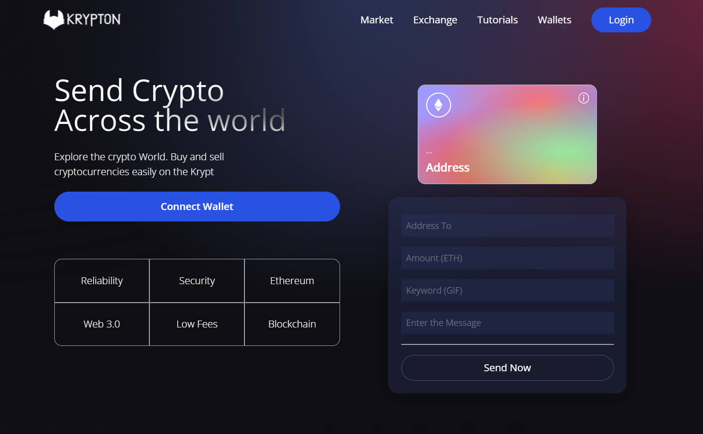

# Krypton_Web3.0_Web_App
A Web_App Created Using React, Solidity , TailwindCSS made using Web3.0 Methodlogies

This is a code repository for the corresponding WebApp Above

It is created Using Web3.0 Methodologies with the help of React.js, Solidity, Tailwind CSS which has been integrated with Metamask

The basic Use is that User can Use this Web app To Send Ethereum Token from One Metamask Wallet to another Metamask Wallet across the world.This process can be simply done by Clicking on the connect Button and sending your required amount

